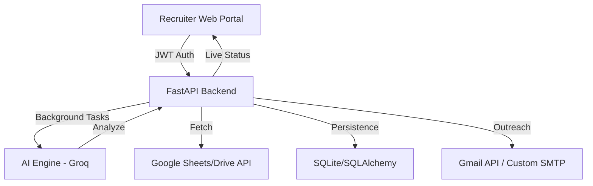

# 🤖 NexusHire AI | Enterprise-Grade AI Recruitment Platform

NexusHire AI is a professional, multi-tenant SaaS platform designed to automate the heavy lifting of high-volume recruitment. It leverages Large Language Models (LLMs) to screen resumes against dynamic job requirements, handles personalized candidate outreach, and provides recruiters with a premium dashboard for real-time tracking.

---

## 🔗 Live Demo
*   **Web Portal**: [https://nexus-hire-ai.vercel.app/](https://nexus-hire-ai.vercel.app/)

---

## 🌟 Solution Overview
Recruiters today are overwhelmed by hundreds of applications per role. NexusHire AI solves this by:
1.  **AI-Validation**: Moving beyond keyword matching to true semantic understanding of resume content.
2.  **Whitelabeling**: Allowing staffing agencies to send emails using their own company branding and SMTP servers.
3.  **Data Persistence**: Organizing thousands of applicants into searchable, historical batches.

---

## 🛠️ Key Technical Features

### 1. 🔐 Security & Identity
- **JWT Authentication**: Secure, stateless user sessions using JSON Web Tokens.
- **Password Protection**: Industry-standard PBKDF2 hashing using the `passlib` library.
- **Strict Multi-Tenancy**: Database-level isolation ensuring recruiters only access their own data.

### 2. 🧠 Intelligent AI Evaluator
- **Dynamic Prompts**: The system constructs complex AI prompts based on the specific `Role Name` and `Role Requirements` provided by the recruiter.
- **LLM Integration**: Powered by Groq Cloud (Llama 3.1) for lightning-fast inference (< 1s per resume).

### 3. 📧 Enterprise Outreach
- **Dynamic Branding**: Automated email templates that use the recruiter's Company Name and Tagline.
- **Custom SMTP Support**: Dual SSL/STARTTLS support for professional mail servers (Gmail, Outlook, SES, etc.).
- **Smart Scheduling**: Automatic generation of Google Meet links for shortlisted candidates.

### 4. 📊 Professional Dashboard
- **Real-Time Feed**: Live progress bars and status updates during the screening process.
- **Data Export**: One-click **CSV Export** for seamless integration with ATS or Excel.
- **Historical Analysis**: View and re-download results from any past screening batch.

---

## 🧩 Architectural Breakdown

---

## ⚙️ Core Stack
- **Backend**: Python, FastAPI, SQLAlchemy
- **Database**: SQLite (Production-ready via SQLAlchemy ORM)
- **AI**: Groq API (Llama 3.1)
- **Frontend**: Vanilla JS, Vanilla CSS (Custom Design System)
- **Integrations**: Google Sheets, Google Drive, Gmail OAuth2

---

## 🏃 User Workflow
1.  **Onboarding**: Recruiter creates an account and logs into the secure dashboard.
2.  **Configuration**: Defines the job role, sets specific screening requirements, and chooses branding options.
3.  **Input**: Pastes a link to a Google Sheet (linked to a candidate application form).
4.  **Execution**: The background engine fetches resumes, parses text, and passes it to the AI for evaluation.
5.  **Outreach**: Shortlisted candidates automatically receive branded interview invites, while Others receive professional rejection emails.
6.  **Tracking**: Recruiter reviews the results and batch history through the analytics dashboard.

---

## 🚀 Future Roadmap
- [ ] **Multi-Model Support**: Integration with OpenAI & Anthropic for flexible AI choices.
- [ ] **Video Screening**: AI-driven analysis of video resume introductions.
- [ ] **Collaborative Hiring**: Role-based access for teams to review candidates together.

---

## 👤 Author
**Abhinay Mente**  
*Computer Science Engineering Student*

Focused on building secure, scalable, and AI-integrated backend systems. I am passionate about solving real-world business problems through clean, maintainable code.

---

📌 *This project was built to demonstrate full-stack proficiency, deployment architecture, and the practical application of LLMs in the HR-Tech space.*
